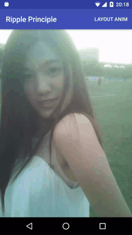

Android自定义水波纹动画View
=========================

源码是双11的时候就写好了，但是我觉得当天发不太好，所以推迟了几天，没想到过了双11女友就变成了前女友，桑心。唉不说了，来看看代码吧。

#展示效果

##Hi前辈
话不多说，我们先来看看效果：


这一张是《Hi前辈》的搜索预览图，你可以在这里下载这个APP查看更多效果：http://www.wandoujia.com/apps/com.superlity.hiqianbei

##LSearchView


这是一个MD风格的搜索框，集成了ripple动画以及search时的loading，使用很简单，如果你也需要这样的搜索控件不妨来试试：https://github.com/onlynight/LSearchView

##RippleEverywhere

女友的照片：


女友的照片：



这是一个水波纹动画支持库，由于使用暂时只支持Android4.0以上版本。https://github.com/onlynight/RippleEverywhere

#实现原理
使用属性动画完成该动画的实现，由于android2.3以下已经不是主流机型，故只兼容4.0以上系统。

关于属性动画，如果还有童鞋不了解可以去看看hongyang大神的这篇文章：http://blog.csdn.net/lmj623565791/article/details/38067475。

>在我看来属性动画实际上就类似于定时器，所谓定时器就是独立在主线程之外的另外一个用于计时的线程，每当到达你设定时间的时候这个线程就会通知你；属性动画也不光是另外一个线程，他能够操作主线程UI元素属性就说明了它内部已经做了线程同步。

##基本原理

我们先来看下关键代码：

```java
@Override
protected void onDraw(Canvas canvas) {
    if (running) {
        // get canvas current state
        final int state = canvas.save();
        // add circle to path to crate ripple animation
        // attention: you must reset the path first,
        // otherwise the animation will run wrong way.
        ripplePath.reset();
        ripplePath.addCircle(centerX, centerY, radius, Path.Direction.CW);
        canvas.clipPath(ripplePath);

        // the {@link View#onDraw} method must be called before
        // {@link Canvas#restoreToCount}, or the change will not appear.
        super.onDraw(canvas);
        canvas.restoreToCount(state);
        return;
    }

    // in a normal condition, you should call the
    // super.onDraw the draw the normal situation.
    super.onDraw(canvas);
}
```

- Canvas#save()和Canvas#restoreToCount()
    这个两个方法用于绘制状态的保存与恢复。绘制之前先保存上一次的状态；绘制完成后恢复前一次的状态；以此类推直到running成为false，中间的这个过程就是动画的过程。

- Path#addCircle()和Canvas#clipPath()
    addCircle用于在path上绘制一个圈；clipPath绘制剪切后的path（只绘制path内的区域，其他区域不绘制）。

```java
radiusAnimator = ObjectAnimator.ofFloat(this, "animValue", 0, 1);

/**
 * This method will be called by {@link this#radiusAnimator}
 * reflection calls.
 *
 * @param value animation current value
 */
public void setAnimValue(float value) {
    this.radius = value * maxRadius;
    System.out.println("radius = " + this.radius);
    invalidate();
}
```

这一段是动画的动效关键，首先要有一个随着时间推移而变化的值，当每次这个值变化的时候我们需要跟新界面让view重新绘制调用onDraw方法，我们不能手动调用onDraw方法，系统给我们提供的invalidate会强制view重绘进而调用onDraw方法。

以上就是这个动画的全部关键原理了，下面我们来一份完整的源码：

```java
import android.animation.Animator;
import android.animation.ObjectAnimator;
import android.annotation.TargetApi;
import android.content.Context;
import android.graphics.Canvas;
import android.graphics.Path;
import android.util.AttributeSet;
import android.view.View;
import android.view.animation.AccelerateDecelerateInterpolator;
import android.widget.ImageView;

/**
 * Created by lion on 2016/11/11.
 * <p>
 * RippleImageView use the {@link Path#addCircle} function
 * to draw the view when {@link RippleImageView#onDraw} called.
 * <p>
 * When you call {@link View#invalidate()} function,then the
 * {@link View#onDraw(Canvas)} will be called. In that way you
 * can use {@link Path#addCircle} to draw every frame, you will
 * see the ripple animation.
 */

public class RippleImageView extends ImageView {

    // view center x
    private int centerX = 0;
    // view center y
    private int centerY = 0;
    // ripple animation current radius
    private float radius = 0;
    // the max radius that ripple animation need
    private float maxRadius = 0;
    // record the ripple animation is running
    private boolean running = false;

    private ObjectAnimator radiusAnimator;
    private Path ripplePath;

    public RippleImageView(Context context) {
        super(context);
        init();
    }

    public RippleImageView(Context context, AttributeSet attrs) {
        super(context, attrs);
        init();
    }

    public RippleImageView(Context context, AttributeSet attrs, int defStyleAttr) {
        super(context, attrs, defStyleAttr);
        init();
    }

    @TargetApi(21)
    public RippleImageView(Context context, AttributeSet attrs, int defStyleAttr, int defStyleRes) {
        super(context, attrs, defStyleAttr, defStyleRes);
        init();
    }

    private void init() {
        ripplePath = new Path();

        // initial the animator, when animValue change,
        // radiusAnimator will call {@link this#setAnimValue} method.
        radiusAnimator = ObjectAnimator.ofFloat(this, "animValue", 0, 1);
        radiusAnimator.setDuration(1000);
        radiusAnimator.setInterpolator(new AccelerateDecelerateInterpolator());
        radiusAnimator.addListener(new Animator.AnimatorListener() {
            @Override
            public void onAnimationStart(Animator animator) {
                running = true;
            }

            @Override
            public void onAnimationEnd(Animator animator) {
                running = false;
            }

            @Override
            public void onAnimationCancel(Animator animator) {

            }

            @Override
            public void onAnimationRepeat(Animator animator) {

            }
        });
    }

    @Override
    protected void onLayout(boolean changed, int left, int top, int right, int bottom) {
        super.onLayout(changed, left, top, right, bottom);
        centerX = (right - left) / 2;
        centerY = (bottom - top) / 2;
        maxRadius = maxRadius(left, top, right, bottom);
    }

    /**
     * Calculate the max ripple animation radius.
     *
     * @param left   view left
     * @param top    view top
     * @param right  view right
     * @param bottom view bottom
     * @return
     */
    private float maxRadius(int left, int top, int right, int bottom) {
        return (float) Math.sqrt(Math.pow(right - left, 2) + Math.pow(bottom - top, 2) / 2);
    }

    /**
     * This method will be called by {@link this#radiusAnimator}
     * reflection calls.
     *
     * @param value animation current value
     */
    public void setAnimValue(float value) {
        this.radius = value * maxRadius;
        System.out.println("radius = " + this.radius);
        invalidate();
    }

    @Override
    protected void onDraw(Canvas canvas) {
        if (running) {
            // get canvas current state
            final int state = canvas.save();
            // add circle to path to crate ripple animation
            // attention: you must reset the path first,
            // otherwise the animation will run wrong way.
            ripplePath.reset();
            ripplePath.addCircle(centerX, centerY, radius, Path.Direction.CW);
            canvas.clipPath(ripplePath);

            // the {@link View#onDraw} method must be called before
            // {@link Canvas#restoreToCount}, or the change will not appear.
            super.onDraw(canvas);
            canvas.restoreToCount(state);
            return;
        }

        // in a normal condition, you should call the
        // super.onDraw the draw the normal situation.
        super.onDraw(canvas);
    }

    /**
     * call the {@link Animator#start()} function to start the animation.
     */
    public void startAnimation() {
        if (radiusAnimator.isRunning()) {
            radiusAnimator.cancel();
        }

        radiusAnimator.start();
    }
}

```

