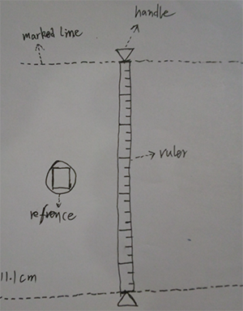

自定义RulerView
==============

#概述
本文主要讲如何继承View实现一个自定义View，然后通过实例RulerView的实现逻辑帮助读者更好的理解自定义View的设计与实现。开讲之前先给博客大神打个广告《Android开发艺术探索》的作者任玉刚的这本书会给想要进阶学习的一个好的开始，带你入门带你飞。

#功能描述
RulerView的具体功能如下：

1. 首先要绘制一把尺子带大小刻度的，这样看起来才像尺子。
2. 尺子的两段要绘制操作手柄，操作手柄起到装饰和提醒的作用，告诉用户两段是可以操作的。
3. 尺子的两头分别带有标线，这样方便用户测量时对齐。
4. 尺子操作手柄实现两点触控操作，提升用户体验，操作简单方便。
5. 在左下角显示测量结果。

示意图如下：

字写的略丑，大家见谅（233）。

效果图如下：

#设计与实现